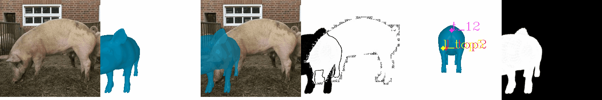
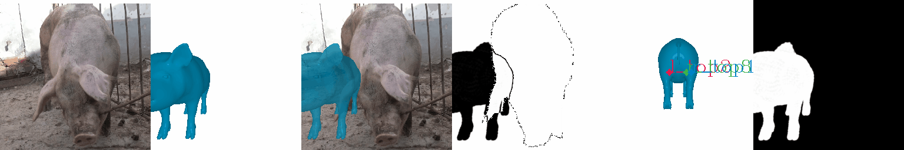
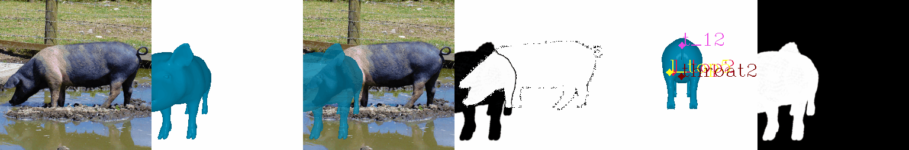
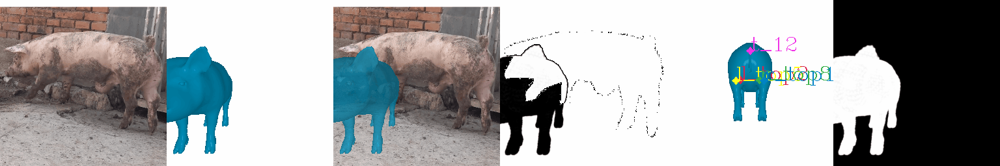
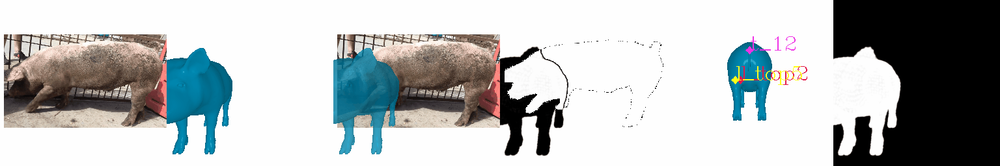

# SMALify-Pig3D
SMALify are optimization-based 3D reconstruction techniques relying on SMAL model. Pig3D as a 3D model can directly replace the SMAL model.











# How to use
1. Clone the repository and enter directory
   ```
   git clone https://github.com/G-Apple1/SMALify-Pig3D.git
   cd SMALify-Pig3D
   ```
2. Install dependencies, particularly [PyTorch (cuda support recommended)](https://pytorch.org/), [Pytorch3D](https://github.com/facebookresearch/pytorch3d). Check [requirements.txt](requirements.txt) for full details.

3. QuickStart: Run on images in the dataset.
   - 5 images: ['000994', '000906', '000635', '000352', '000372']
      ```
      python smal_fitter/optimize_to_joints.py
      ```
